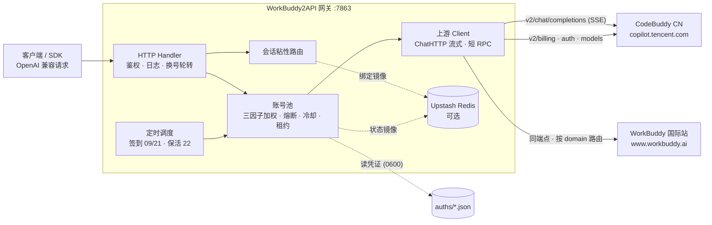

<p align="center">
  
</p>

<h1 align="center">WorkBuddy2API</h1>

<p align="center">
  <b>把腾讯 CodeBuddy 账号变成 OpenAI 兼容 API 的多账号网关</b><br>
  OAuth 登录 · 账号池轮转 · 熔断与冷却 · 会话粘性 · 定时签到保活 · 流式/非流式
</p>

<p align="center">
  
  
  
  
</p>

---

## 📖 项目简介

WorkBuddy2API 是一个自托管的 **OpenAI 兼容反向代理网关**，将腾讯 CodeBuddy（`copilot.tencent.com`）与 WorkBuddy 国际站（`www.workbuddy.ai`）账号包装为统一的 `/v1/chat/completions` 服务。**两个区域可混编在同一个账号池**：按凭证里的 `domain` 自动判定区域，各自路由到对应上游 host 与 Origin。

- 官方不提供 OpenAI 形态的开放 API，本项目通过 **OAuth 设备授权** 获取账号凭证，在网关侧做 token 自动刷新、账号池调度与流量治理；
- 面向 **个人多账号** 场景：多账号共享、单号故障自动换号、冷却/熔断防止雪崩、会话粘性保证多轮上下文不跳号；
- 对客户端只暴露 OpenAI 兼容接口，现有 SDK / 前端 / 工具 **零改造接入**。

> ⚠️ 合规须知：本项目是**非官方**网关，使用 CodeBuddy 账号作为上游，**仅限本人授权账号、本机/私有环境测试**。详细边界见 [安全与合规](#-安全与合规)。

## ✨ 核心能力

| 能力 | 说明 |
|---|---|
| 🔑 **OAuth 一键登录** | `login.sh [cn\|global]` 设备授权流程（无 PKCE），自动落盘凭证并重启容器 |
| 🌏 **双区域混编** | CN 与国际站账号可同池共存，按凭证 `domain` 自动路由 host / Origin / 计费接口 |
| 🔄 **多账号池** | 三因子加权随机选号（积分比例 ×10 + 闲置补偿 + 成功率 ×3），Top-5 候选 + 防惊群 |
| 🛡️ **熔断与冷却** | 429/404 软冷却、402/余额不足硬冷却至次日 04:00、连续失败指数退避熔断、在途租约限流 |
| 🧲 **会话粘性** | 同一会话（`conversation_id`）尽量绑定同一账号，TTL 滚动续期，失败自动解绑 |
| ⏰ **定时任务** | 每日 09:00 / 21:00 自动签到 + 余额查询解冻；22:00 全账号 token 刷新保活 |
| ⚡ **流式 + 非流式** | 上游 SSE 逐帧规范化透传；出站强制 `stream:true`，非流式由本地聚合为单响应 |
| 🧠 **推理模型兼容** | `reasoning_content` 白名单保留、工具调用（`tool_calls`）按 index 合并、effort 自动降级 |
| 📊 **可观测** | 每请求一行表格日志（TTFB/token 速率/uid）；`/healthz` 可接负载均衡 |
| 💾 **状态持久化** | 池状态本地原子落盘 + Upstash Redis 异步镜像（可选），重启择新恢复 |
| 🗑️ **指纹脱敏** | 出站请求体黑名单指纹字段清洗（可关闭） |

## 🗺️ 架构总览



## 🚀 快速开始

### 环境要求

两种部署方式，按场景选：

| 方式 | 适用 | 要求 |
|---|---|---|
| **本机直跑** | 单机自用（推荐） | 用 `./run.sh`；编译需 Go ≥ 1.22 |
| **Docker** | 部署到别的机器 / 服务器 | Docker + Docker Compose |

本机没装 Go 时，可先用 Docker 交叉编译出二进制（编译一次即可，运行不需要 Docker）：

```bash
docker run --rm -v "$PWD":/src -w /src -e GOOS=darwin -e GOARCH=arm64 -e CGO_ENABLED=0 \
  golang:1.23-alpine go build -trimpath -ldflags="-s -w" -o /src/wb2api ./cmd/server
```

### 1. 克隆并配置

```bash
git clone https://github.com/Sliverkiss/workbuddy2api.git
cd workbuddy2api
cp config.example.json config.json
```

一份 `config.json` 管全部实例（共享段 + `instances` 分节），**至少设置 `api_key`**（`留空 = 不鉴权`，公网部署务必设置）：

```bash
# 用编辑器把 "api_key" 改成你自己的强随机串
```

要跑多个实例（CN / 国际站各一个端口），在 `instances` 里各写一份覆盖字段即可——共享段只写一次：

```jsonc
{
  "api_key": "sk-...",                       // 共享：两个实例都继承
  "auth_dir": "./auths",
  "console": { "listen": "127.0.0.1:7860", "token": "<随机串>" },
  "instances": {
    "cn":     { "region": "cn",     "listen": ":7864", "state_file": "./data/state.cn.json" },
    "global": { "region": "global", "listen": ":7865", "state_file": "./data/state.global.json" }
  }
}
```

启动时用 `-instance <名字>` 指定跑哪个（`./run.sh` 已带好该参数）；名字随便取，`instances` 里有几个就能起几个。旧的"一实例一文件"单实例格式仍然兼容（顶层直接写 `listen`/`region`，不带 `instances`），此时不必传 `-instance`。

### 2. 登录添加账号

```bash
./login.sh            # CN 账号（copilot.tencent.com）
./login.sh global     # 国际站账号（www.workbuddy.ai）
# 1) 脚本输出授权 URL
# 2) 浏览器打开完成登录
# 3) 回到终端按 y → 自动签到 → 落盘 auths/workbuddy-<uid>.json → 重启容器
```

多账号只需重复执行（两区可混用，区域由凭证 `domain` 判定，无需改配置）；账号池自动发现 `auths/` 下新增凭证文件（启动时 `SyncToDir` 对齐）。

### 3. 启动服务

```bash
./run.sh              # 起配置里的全部实例（后台），并回显状态
```

#### Docker 部署（换机器/服务器）

一个容器内跑 **`instances` 里声明的全部实例 + 控制台**，默认端口 `7864` / `7865` / `7860`。

```bash
cp config.example.json config.json    # 改 api_key；容器部署还要改 console 段（见下）
./login.sh cn && ./login.sh global    # 生成 auths/*.json（凭证不进镜像）
docker compose up -d --build
docker compose logs -f                # 日志带 [cn] / [global] / [console] 前缀
```

**容器部署要在 `config.json` 里改 `console` 段**——容器内监听回环地址的话容器外访问不到，而控制台对非回环监听强制要求令牌：

```json
"console": { "listen": "0.0.0.0:7860", "token": "换成你的强随机串" }
```

访问 `http://<host>:7860/?token=<token>`。令牌与监听都在这一个文件里，不必再设环境变量（`WB2A_CONSOLE_LISTEN` / `WB2A_CONSOLE_TOKEN` 仍可临时覆盖）。

**只跑一个区**：删掉 `instances` 里不要的那个实例，entrypoint 只启存在的（控制台的实例卡片也随之只剩一个）。

关键设计：

- **凭证与配置不进镜像** —— `auths/`、`data/`、`config.json` 都由 compose 挂载；`.dockerignore` 已排除，避免 token 被烤进镜像层
- **配置只读挂载**（`:ro`），改配置要重启容器；`auths/` 与 `data/` 必须可写（token 刷新、状态落盘）
- **容器内的控制台管不了容器内的进程**：控制台看不到容器内的 pid，所以「启动/停止」会提示"进程不在可管理范围内，请用 docker compose stop"——这是有意的，避免瞎发信号。日常运维用 `docker compose stop/start/restart`
- **健康检查**：脚本 `docker-healthcheck.sh` 按 config 里的端口逐个探测，**只要 HTTP 有响应就算健康**（`/healthz` 503 = 活着但无可用账号，属正常业务状态，不判不健康）
- **别和本机实例同时跑同一批账号**：两个进程各自持有同一份 `auths/` 时，token 刷新会互相顶掉（刷新令牌是轮换的）。换机器部署前先 `./run.sh stop`
- **架构**：`CGO_ENABLED=0` 静态编译，`docker buildx build --platform linux/arm64` 可跨架构构建（群晖/树莓派等）

#### 拆分两套流程（CN / 国际站各一个端口）

两个区域各跑一个独立实例（各自端口、各自状态、互不影响），靠 `region` 把实例锁定到单一区域：

```bash
./run.sh              # 一键起配置里的全部实例（后台）——最常用
./run.sh status       # 查看各实例状态与健康
./run.sh stop         # 全部停掉（等价 ./run.sh stop both）
./run.sh cn -d        # 只起 CN 实例     → :7864   data/state.cn.json
./run.sh global -d    # 只起国际站实例  → :7865   data/state.global.json
./run.sh cn           # 前台跑单个实例（调试用，Ctrl-C 退出）
./run.sh console -d   # 起控制台 → http://127.0.0.1:7860/（网页查看状态 + 点击启停）
```

实例清单来自 `config.json` 的 `instances` 分节，不写死在脚本里：加一个实例，`./run.sh <名字> -d` 就能起它；加实例时 `instances` 里也一并给它 `listen` 和 `state_file`。

子命令与目标顺序任意、都可缺省：`./run.sh stop both` 与 `./run.sh both stop` 等价，`stop`/`status`/`both` 作用于**配置里的全部实例**。多个实例恒为后台（前台模式下 start 用 `exec` 替换进程，后面的实例起不来，脚本会自动加 `-d` 并提示）。

`./run.sh` **不依赖 Docker、也不需要 python3/jq**：配置一律交给 `./wb2api` 自己解析（`-print-listen` / `-list-instances`），脚本只做进程管理；编译优先用本地 Go，没装 Go 时沿用已交叉编译好的 `./wb2api`（改源码后需重新编译，脚本会提示命令）。

### 网页控制台

```bash
./run.sh console -d    # 后台启动，打开 http://127.0.0.1:7860/
./run.sh console       # 前台启动；console stop|restart|status|logs 同理
```

监听地址与令牌取自 `config.json` 的 `console` 段（命令行 `-listen` / `-token` 可覆盖）。

一个页面看全所有实例，并直接操作：

| 区块 | 内容 |
|---|---|
| **总览** | 账号总数 / 健康 / 冷却 / 禁用 / 总积分 / 运行实例数 |
| **实例** | 每实例一张卡片：运行状态、健康、账号数、冷却数、pid、region；按钮 **启动 / 停止 / 重启 / 面板↗ / 日志**，以及运维 **立即签到 / 立即保活 / 解冻全部** |
| **账号池** | 聚合各实例的全部账号：实例、UID、昵称、区域、积分、状态（健康 / 冷却剩余 / 禁用原因）、成功率、在途、最近成功；每行可 **解冻** |
| **模型** | 每个实例当前可用模型（多区域各自一份，取实拉结果） |
| **日志** | 常驻日志卡片：实例一键切换、行数（100/300/1000/3000）、跟随最新、自动刷新；实例卡片上的「日志」按钮会切到该实例并把卡片滚进视野。支持 `?log=global` 深链直达 |

3 秒自动刷新；除日志卡片外，其余区块都随刷新重建。

**为什么控制台必须是独立进程**：网关面板 `/ui` 由实例自己提供，实例一停页面就没了，无法用它"启动自己"。所以控制台是一个不随实例生灭的常驻进程。

安全边界（进程控制比看状态敏感）：

- 默认只监听 `127.0.0.1:7860`，局域网/公网访问不到；
- 若监听绑到非回环地址（如容器里的 `0.0.0.0:7860`），**必须**在 `console.token` 里给令牌，否则拒绝启动；设了令牌后所有 `/api/*` 需带 `X-Console-Token` 头或 `?token=` 参数；
- 受管实例清单来自 `config.json`（命令行 `-instances name:Label[,...]` 可覆盖）；
- 与 `run.sh` 共用同一套 `data/run/<name>.pid` 与 `data/logs/<name>.log`，两边启动的实例互相可识别、可停。

控制台背后的实例接口（都走 `api_key` 鉴权）：`POST /admin/checkin`（立即签到+余额刷新）、`POST /admin/keepalive`（立即刷新 token）、`POST /admin/revive`（解冻冷却，body 带 `uid` 解冻单个，空 body 解冻全部）。签到/保活复用定时任务的同一实现，避免两条路径行为漂移。

> **解冻的语义**：只清即时冷却（`until`/`cool_kind`/`reason`），**不动熔断、不解除 `disabled`**——熔断反映连续 5xx 这类通道健康问题，不该被一次手动解冻掩盖；`disabled` 是 session 死亡，必须重新登录。

实例之间**共用同一个 `auths/` 目录**——启动时按凭证 `domain` 各自过滤，互不干扰：

```text
region=cn:     kept 2/2 account(s) from ./auths (skipped 0 by region)
region=global: kept 0/2 account(s) from ./auths (skipped 2 by region)
```

`region` 取 `"cn"` / `"global"`；留空或不写 = 两区混编同池（旧配置行为，无需改动）。非法值会在启动时报错，不会静默退化成"混编"。启用 Upstash 时两实例的键自动按区域加命名空间（`wb2api:cn:*` / `wb2api:global:*`），不会互相覆盖。

### 4. 验证

下面以 CN 实例（`:7864`）为例，国际站把端口换成 `:7865` 即可。

```bash
# 健康检查（无可用账号时 503）
curl -s http://localhost:7864/healthz

# 模型列表
curl -s http://localhost:7864/v1/models \
  -H "Authorization: Bearer your-api-key"

# 账号状态（汇总 + 每账号详情）
curl -s http://localhost:7864/status \
  -H "Authorization: Bearer your-api-key"

# 流式聊天
curl -sN http://localhost:7864/v1/chat/completions \
  -H "Authorization: Bearer your-api-key" \
  -H "Content-Type: application/json" \
  -d '{"model":"deepseek-v4-flash","messages":[{"role":"user","content":"hi"}],"stream":true}'

# 非流式聊天（本地聚合）
curl -s http://localhost:7864/v1/chat/completions \
  -H "Authorization: Bearer your-api-key" \
  -H "Content-Type: application/json" \
  -d '{"model":"deepseek-v4-flash","messages":[{"role":"user","content":"hi"}],"stream":false}'
```

## ⚙️ 配置说明

完整字段以 [`config.example.json`](config.example.json) 为样例（下表为各字段含义）。一份文件描述全部实例：

```jsonc
{
  // ── 共享段：所有实例的默认值，实例里写了的字段才覆盖 ──
  "api_key": "your-api-key-here",
  "auth_dir": "./auths",
  "cooldown": { "soft_rate": "60s" },
  "schedule": { "checkin_hours": [9, 21], "keepalive_hours": [22] },
  "upstream": {
    "timeout_seconds": 120,
    "header_timeout_seconds": 120,
    "idle_timeout_seconds": 300
  },
  "features": { "sanitize_blacklist_fingerprints": true },
  "upstash": { "url": "", "token": "" },
  "pool": {
    "max_in_flight": 3,
    "breaker_threshold": 3,
    "breaker_cooldown": "30m",
    "breaker_cooldown_max": "6h",
    "idle_weight_per_hour": 0.5,
    "idle_weight_max": 5.0
  },
  "session_sticky": { "enabled": true, "ttl": "30m", "gc_interval": "5m" },

  // ── 控制台（cmd/console 读这一段；网关实例忽略）──
  "console": { "listen": "127.0.0.1:7860", "token": "" },

  // ── 实例：key 就是启动时的 -instance 名字 ──
  "instances": {
    "cn":     { "region": "cn",     "listen": ":7864", "state_file": "./data/state.cn.json" },
    "global": { "region": "global", "listen": ":7865", "state_file": "./data/state.global.json" }
  }
}
```

合并顺序：`内置默认 → 共享段 → instances[名字] → 环境变量`，所以共享段写一次，实例只写差异（通常就是 `region` / `listen` / `state_file`）。

### 字段速查

| 字段 | 默认 | 说明 |
|---|---|---|
| `listen` | `:7863` | HTTP 监听地址（多实例部署请逐实例指定，否则会撞端口） |
| `api_key` | 空 | 网关鉴权密钥；**空 = 不鉴权直接放行**（公网必须设置）。可被实例覆盖（让两实例用不同 key） |
| `auth_dir` | `./auths` | 账号凭证目录（通常共享一份，按凭证 `domain` 自动分区） |
| `state_file` | `./data/state.json` | 账号池状态持久化文件（多实例部署**必须各自一份**，否则互相覆盖） |
| `region` | 空 | `cn` / `global` 锁定实例区域；空 = 两区混编 |
| `models_extra` | `[]` | 额外对外暴露的模型 ID（追加到上游动态列表后，去重）。上游清单不准，用这个补齐，见下 |
| `console.listen` | `127.0.0.1:7860` | 控制台监听地址；容器部署改 `0.0.0.0:7860` |
| `console.token` | 空 | 控制台令牌；监听非回环地址时**必须**非空，否则拒绝启动 |
| `instances` | `{}` | 多实例分节：key 为实例名（`-instance` 取值），value 为该实例的覆盖字段。**不写这个分节 = 兼容旧单实例格式**（顶层字段即该实例全部配置，不必传 `-instance`） |
| `cooldown.soft_rate` | `60s` | 429/404 软冷却时长 |
| `schedule.checkin_hours` | `[9, 21]` | 每日本地时区整点签到 + 余额查询 |
| `schedule.keepalive_hours` | `[22]` | 每日本地时区整点刷新 token 保活 |
| `upstream.timeout_seconds` | `120` | 短 RPC（刷新/签到/余额/模型）总时长上限 |
| `upstream.header_timeout_seconds` | 回落 `timeout_seconds` | 聊天首字节前（响应头）上限 |
| `upstream.idle_timeout_seconds` | `300` | 聊天流中空闲上限（活跃续命，静默断流） |
| `features.sanitize_blacklist_fingerprints` | `true` | 出站请求体黑名单指纹脱敏 |
| `upstash.url` / `token` | 空 | 空 = 纯内存模式（Noop 降级，功能照常） |
| `pool.max_in_flight` | `3` | 单账号最大在途请求数（`0` = 不限） |
| `pool.breaker_threshold` | `3` | 连续失败触发熔断阈值 |
| `pool.breaker_cooldown` | `30m` | 熔断基础退避时长 |
| `pool.breaker_cooldown_max` | `6h` | 指数退避封顶 |
| `pool.idle_weight_per_hour` | `0.5` | 闲置补偿：每小时未使用 +0.5 权重 |
| `pool.idle_weight_max` | `5.0` | 闲置补偿权重封顶 |
| `session_sticky.enabled` | `true` | 会话粘性路由开关 |
| `session_sticky.ttl` | `30m` | 会话绑定 TTL（滚动续期） |
| `session_sticky.gc_interval` | `5m` | 过期绑定 GC 周期 |

### 实例相关命令行开关

| 开关 | 作用 |
|---|---|
| `-config <path>` | 配置文件路径（默认 `config.json`） |
| `-instance <name>` | 跑 `instances` 里的哪个实例；配置含多实例时**必填**（不填会报错并列出可选名字，避免跑成空壳） |
| `-list-instances` | 只打印配置里的实例名（每行一个）后退出；`run.sh` / 容器入口靠它枚举要起的实例 |
| `-print-listen` | 只打印某实例生效的监听地址后退出（配合 `-instance`）；`run.sh` 靠它读端口 |

`cmd/console` 另有 `-listen` / `-token` / `-instances name:Label[,...]`，都可省略——默认从 `config.json` 的 `console` 段与 `instances` 分节推导。

### 上游超时语义（三段各归其位）

| 字段 | 作用对象 | 默认 | 行为 |
|---|---|---|---|
| `timeout_seconds` | 短 RPC（token 刷新 / 签到 / 余额 / 模型列表） | `120` | 总时长硬上限，到期报错走换号/熔断 |
| `header_timeout_seconds` | 聊天 SSE **首字节前** | `120` | 由 `Transport.ResponseHeaderTimeout` 约束；超时 = 换号重发 |
| `idle_timeout_seconds` | 聊天 SSE **流中空闲** | `300` | 活跃吐数据**续命**不掐；静默超时才断流释放租约 |

聊天流（`stream` true/false 均同）**没有总时长上限**：聊天使用 `Timeout=0` 的专用 client，长思考/长输出（如超长 reasoning）不会被 120s 掐断。

### 环境变量覆盖

加载顺序：JSON 文件（共享段 → `instances[名字]`）→ `WB2A_*` 环境变量（变量非空才覆盖）：

`WB2A_LISTEN` · `WB2A_API_KEY` · `WB2A_AUTH_DIR` · `WB2A_STATE_FILE` · `WB2A_REGION` · `WB2A_MODELS_EXTRA`（逗号分隔） · `WB2A_SOFT_RATE`（duration） · `WB2A_TIMEOUT_SECONDS` · `WB2A_HEADER_TIMEOUT_SECONDS` · `WB2A_IDLE_TIMEOUT_SECONDS` · `WB2A_SANITIZE_FINGERPRINTS`（bool）

脚本/容器另有三个变量：`WB2A_CONFIG`（配置文件路径，默认 `config.json`；容器里默认 `/app/config.json`）、`WB2A_CONSOLE_LISTEN` / `WB2A_CONSOLE_TOKEN`（临时覆盖控制台的监听与令牌，正常写在 `console` 段即可）。

### 模型列表（`/v1/models`）与 `models_extra`

默认来源是上游 `/v3/config` 里 `agents[name=="cli"].models` 白名单（官方客户端同款）。**但实测上游这份数据两个方向都不准**（2026-09-11 逐一探测记录）：

| 情况 | 例子 |
|---|---|
| 白名单**漏**了实际能用的 | 国际站 `deepseek-v4.1-flash`（`/v3/config` 全文搜索 0 次，chat 调用却正常）、`hy4-preview`；CN `deepseek-v4-flash`、`glm-5.0-turbo`、`hunyuan-chat` |
| 上游 catalog 列了**本区不存在**的 | 国际站 `gpt-5.1-codex`、`gemini-2.5-flash`、`deepseek-v3-2-volc`；CN `glm-4.6/4.7`、`kimi-k2-thinking` |

所以清单只能"以官方白名单为准，再让你手工补"。`models_extra` 就是那个补充入口——只影响 `/v1/models` 的**展示**与模型→区域亲和判断，**不影响能否调用**（`/v1/chat/completions` 不校验 model 是否在列表里，直接透传上游）。

```json
{ "models_extra": ["deepseek-v4.1-flash", "hy4-preview"] }
```

[`config.example.json`](config.example.json) 里已按实测预填了两区的 `models_extra`（CN 6 个、国际站 5 个补充 ID，叠加上游白名单后 `/v1/models` 共 20 / 22 个）。换账号/换区后若发现清单与实际不符，把实测可用的 ID 加进去即可。

## 🧠 账号池与流量治理

### 账号状态机

每个账号由三个正交维度描述：

| 维度 | 字段 | 说明 |
|---|---|---|
| 健康 | `disabled` / `until` / `breakerUntil` | `healthy = !disabled && !until && !breakerUntil` |
| 并发 | `inFlight` | 在途租约（运行态，不持久化），上限 `max_in_flight` |
| 统计 | `successCount` / `errTotal` / `lastUsed` | 供成功率权重与闲置补偿 |

```text
  Healthy ──429/404 软冷却 / 402 硬冷却 / 5xx 熔断──▶ 冷却·熔断期
     ▲                                                │
     │       到期自动恢复 / 签到余额解冻 / 成功清零     │
     └────────────────────────────────────────────────┘

  Disabled（session 死亡，永久，需人工重新 login.sh）
```

### 区域混编与选号

CN 与国际站账号可共存于同一池，选号与兜底都在**同区**内进行（跨区会把凭证发到不认它的 host，必被上游拒绝——实测 CN 凭证打国际站 chat 返回 401）：

| 场景 | 行为 |
|---|---|
| 普通轮换 | 全区候选，三因子加权随机（区域不参与权重） |
| 模型仅存在于某一区 | 选号限定在该区（模型表来自动态拉取，缓存未就绪时不限定） |
| 粘性号与请求模型不同区 | 解绑后改走该模型的区域 |
| 区域受限但该区无可用号 | 放宽回全区轮换（避免因模型表滞后把请求锁死成 503） |
| 全冷却兜底 | 仅在请求所需区域内挑最早到期者 |

各区域的模型列表与 `supportedEfforts` 能力表**分区缓存**，互不覆盖（两区模型表不同）。

### 错误分类与处置

| 分类 | 触发条件 | 账号处置 | 恢复 |
|---|---|---|---|
| 余额不足 | HTTP 402 / body 含余额关键词 | 硬冷却到**次日 04:00**（本地时区） | 签到（09/21 点）余额恢复自动解冻 |
| 频控 | HTTP 429 | 软冷却 `soft_rate`（60s） | 到期自动恢复 |
| Session 失效 | body 含 `Offline user session not found` / `12153` | **永久禁用** | 人工重新登录 |
| 上游 404 | HTTP 404 | 软冷却（60s） | 到期自动恢复 |
| 服务端错误 | HTTP ≥500 | 喂连续失败计数，达阈值熔断 | 熔断到期 / 成功清零 |
| 客户端错误 | 其余 4xx / 业务 `code≠0` | 不处罚，换号重试 | 即时 |

**熔断器**：所有冷却入口（429/404/402）与 5xx 共用唯一连续失败计数器 `fails`；累计达 `breaker_threshold`（默认 3）触发熔断，退避 `breaker_cooldown × 2^retryCount`，封顶 `6h`；成功清零。

### 选号策略

1. 过滤：禁用 / 冷却 / 熔断 / 在途占满账号不参与
2. 取 **Top-5** 候选（按三因子权重降序，积分只是因子之一）
3. 三因子加权随机：
   `weight = credits 比例 ×10 + idleWeight + successRate ×3`
   - `credits 比例` = 该号积分 / 候选集最大积分
   - `idleWeight` = `min(闲置小时 × idle_weight_per_hour, idle_weight_max)`，从未使用给满分
   - `successRate` = `successCount/(successCount+errTotal)`，无记录给中性 1.5
4. 防惊群：跳过 100ms 内刚被选中的账号；全冷却时从非禁用、非余额耗尽的软冷却/熔断账号中选最早到期者顶班

### 会话粘性

同一会话尽量复用同一账号，多轮对话不跳号：

- 会话键提取顺序：`metadata.conversation_id` → `metadata.user_id` → 顶层 `conversation_id`
- TTL 滚动续期（默认 30m），GC 周期 5m；绑定可镜像到 Redis（7 天）防重启丢失
- 请求失败自动解绑；成功后绑定跟随最终成功账号

### 定时任务

| 任务 | 时刻（本地时区） | 行为 |
|---|---|---|
| 签到 | `checkin_hours` 默认 `[9, 21]` 整点 | 签到 + 余额查询；余额恢复则解冻冷却账号 |
| 保活 | `keepalive_hours` 默认 `[22]` 整点 | 全账号刷新 token；session 失效自动禁用 |

时区取本机时区（`TZ` 环境变量可覆盖）。同一容器/机器内的实例共用同一时区，签到/保活时点一致。

## 🔌 API 端点

| 端点 | 鉴权 | 说明 |
|---|---|---|
| `POST /v1/chat/completions` | Bearer（`api_key` 非空时） | OpenAI 兼容补全；流式/非流式；请求体上限 8 MiB |
| `GET /v1/models` | Bearer（`api_key` 非空时） | 模型列表（动态拉取，缓存 1h；失败回落静态表 + 5min 负缓存） |
| `GET /status` | Bearer（`api_key` 非空时） | 账号状态汇总 + 每账号详情（区域/积分/冷却/熔断/在途/粘性） |
| `GET /healthz` | 无 | 健康检查：有 healthy 且未占满账号返回 200，否则 503 |
| `GET /ui`（`/` 跳转至此） | 无 | 运维面板：账号池 / 模型列表 / 聊天测试（见下） |

> 鉴权规则：仅当 `api_key` 非空才校验 `Authorization: Bearer <api_key>`；**`api_key` 为空时上述端点直接放行**；`/healthz` 与 `/ui` 恒无鉴权。

### 运维面板 `/ui`

浏览器打开 `http://127.0.0.1:7864/ui`（或对应实例端口）即可：

- **账号池**：汇总计数 + 每账号 UID/昵称/区域/积分/状态（健康、冷却剩余、禁用原因、熔断计数）/成功率/在途/最近成功
- **模型**：当前实例可用模型（多区域混编时取并集）
- **聊天测试**：选模型直接发消息，按流式逐字显示，并给出 TTFB / 总时长 / token 速率
- 顶部可在 `:7864`（CN）与 `:7865`（国际站）之间一键切换；默认每 5s 自动刷新

面板本身是**无鉴权的静态页面**（不含任何密钥）；它展示的数据由浏览器带 `Authorization` 头去调 `/status`、`/v1/models`，因此仍受 `api_key` 保护。API Key 填在页面里（存本机 localStorage），服务端不保存。

### 流式行为细节

- 出站请求强制 `stream:true`；SSE 帧按 OpenAI 规范**白名单重建**（`reasoning_content` 保留、工具调用按 index 合并、未知字段剥离）
- 保证恰好一个 `data: [DONE]`（上游漏发时兜底补写）；空流先写一帧 `error` 再补 `[DONE]`；`error` 帧原样透传

## 📋 请求级日志

每个 `/v1/chat/completions` 请求结束时输出一行表格日志（stdout）：

```text
| #001 | 18:31:31 | deepseek-v4 | stream | 200 | uid=0851ce35 | TTFB=801ms | tok=60 | 23.5tok/s | total=2.6s |
```

| 字段 | 说明 |
|---|---|
| `#001` | 进程级请求序号 |
| `18:31:31` | 结束时刻 |
| `deepseek-v4` | 模型名（超 11 字符截断） |
| `stream` / `sync` | 请求模式 |
| `200` | 状态码 |
| `uid=0851ce35` | 账号 UID 前 8 位 |
| `TTFB` | 流式首帧耗时（非流式为 `-`） |
| `tok` / `tok/s` / `total` | 输出 token 数 / 速率 / 总时长 |

**敏感度**：日志不含任何 token 明文（详见[安全与合规](#-安全与合规)），无落盘日志文件。

## 🛡️ 安全与合规

### 1. 凭据管理（auths）

- **位置**：`./auths`（`auth_dir` 可配），文件名 `workbuddy-<uid>.json`
- **内容**：明文 `accessToken` / `refreshToken` + 账号元信息，结构见下：

```json
{
  "account": { "uid": "…", "enterpriseId": "…", "nickname": "…" },
  "auth": { "accessToken": "明文", "refreshToken": "明文", "expiresAt": 0, "domain": "" }
}
```

> `domain` 决定区域路由：`*.workbuddy.ai` / `*.codebuddy.ai` → 国际站，空值或其他 → CN。改域等同于换区，重启即生效。

- **权限**：容器内以 `app` 用户（uid 10001）运行；token 刷新由 `SaveAtomic` 以 `0600` 原子写回（tmp + rename）；`login.sh` 首次落盘遵循登录 umask，建议手动 `chmod 600 auths/*.json`
- **备份**：备份 `auths/`（凭证）与 `data/state.*.json`（池状态：积分/冷却/计数）；配置 Upstash 后状态另镜像至 Redis
- **切勿提交 git**：`.gitignore` 已排除 `auths/`、`data/`、`backups/`、`config.json`、`config.cn.json`、`config.global.json`、`*.key`、`*.pem`

### 2. 网络暴露与日志敏感度

- 默认监听 `:7863`（可用 `listen` 改，多实例部署逐实例指定；建议本地部署时绑 `127.0.0.1`），**无内置 TLS**；公网部署必须设置 `api_key`，建议前置反代/内网
- 请求日志字段：序号/模型/模式/状态码/**uid 前 8 位**/TTFB/token 数——**不含** `accessToken`/`refreshToken`/`api_key` 明文（不读取 `Authorization` 头）
- 日志写 **stdout/stderr**；代码不落任何日志文件。`./run.sh` 后台模式会把它们重定向到 `data/logs/<name>.log`

### 3. 上游访问端点清单

各端点按账号区域走不同 host（CN / 国际站两套部署，凭证不可混用）：

| 端点 | 方法 | CN Host | 国际站 Host | 用途 |
|---|---|---|---|---|
| `/v2/chat/completions` | POST | `copilot.tencent.com` | `www.workbuddy.ai` | 聊天补全（SSE） |
| `/console/enterprises/personal/models` | GET | 同上 | 同上 | 动态模型列表 |
| `/v2/plugin/auth/token/refresh` | POST | 同上 | 同上 | token 刷新 |
| `/v2/billing/meter/daily-checkin` | POST | `www.codebuddy.cn` | `www.workbuddy.ai` | 每日签到 |
| `/v2/billing/meter/get-user-resource` | POST | 同上 | 同上 | 余额查询 |
| `/v2/plugin/auth/state?platform=CLI` | POST | `copilot.tencent.com` | `www.workbuddy.ai` | OAuth 取授权 URL |
| `/v2/plugin/auth/token?state=` | GET | 同上 | 同上 | OAuth 轮询取 token |
| `/v2/plugin/login/account?state=` | GET | 同上 | 同上 | OAuth 取账号信息 |

> **区域判定**：凭证 `auth.domain` 以 `workbuddy.ai` / `codebuddy.ai`（含子域）结尾 → 国际站；空值或其他（含 `*.workbuddy.cn` / `*.codebuddy.cn`）→ CN。区域决定上游 host 与 `Origin`/`Referer` 的取值（对齐官方 CLI 行为；实测上游当前不校验 Origin）。`*.codebuddy.ai` 与 `*.workbuddy.ai` 是同一套国际站部署（同一 realm，JWKS 完全相同），互为等价入口。

> **凭证不通用（重要）**：CN 与国际站是两套独立 Keycloak realm，签名密钥不同（实测 JWKS 无一相同），CN 的 access token 拿到国际站请求会被拒（401）。一个凭证只能配它所属区域的 host，所以区域判定必须准确——写错 `domain` 会让该账号在每次请求都被上游拒绝。

> 上述 `/v2/*` 端点是 CodeBuddy 官方 CLI/插件使用的接口，**未见公开 API 文档，属非公开/逆向接口**；本项目不主张任何上游接口的官方授权或稳定性承诺。出站统一携带 `CLI/2.63.2 CodeBuddy/2.63.2` UA；聊天请求带账号头（`X-User-Id` 等），**永不携带 `X-Refresh-Token`**。

### 4. 发布来源与合规边界

- **无预编译 release**：仓库无 Release / tag，产物 = 源码自构建
- 构建命令：`CGO_ENABLED=0 go build -trimpath -ldflags="-s -w" -o wb2api ./cmd/server`（控制台另加 `./cmd/console`）
- 登录/签到/积分工具：`./login.sh` / `./signin.sh` / `./credit.sh`（缺失时自动编译对应 `cmd/*`）
- **无产物校验和**：`go.sum` 仅约束 Go 模块依赖；二进制由本机源码直接编译，未引用第三方镜像
- 上游 CodeBuddy 属腾讯系商业产品，本项目是其**非官方 OpenAI 兼容网关**；使用其账号做 API 网关涉及目标平台服务条款与账号风险，作者不对账号封禁、条款违约或使用结果负责

### 5. 授权使用边界

- 仅限**本人授权账号**、本机/私有环境测试
- 不得共享、转售、违规分发，或用于违反目标平台条款的用途
- 遵守 CodeBuddy 平台服务条款与所在地法律
- 妥善保管 `auths/`（明文凭证）与网关端口

## 🧰 工具脚本

| 脚本 | 用途 |
|---|---|
| `./run.sh [目标] [子命令]` | 启停/查看/日志（目标 = `cn`/`global`/`both` 或配置里自定义的实例名） |
| `./run.sh console` | 独立控制台（网页看状态 + 点击启停 + 签到/保活/解冻） |
| `./login.sh [cn\|global]` | OAuth 登录 → 落盘 auth |
| `./signin.sh [auths_dir]` | 批量签到（过期先刷新，按账号区域路由） |
| `./credit.sh` / `./credit.sh -json` | 积分日报（美化 / 原始 JSON，按账号区域路由） |
| `docker-entrypoint.sh` | 容器入口：按 config 的 `instances` 起全部实例 + 控制台 |
| `docker-healthcheck.sh` | 容器健康检查：按 config 端口探测，有 HTTP 响应即健康 |

## 🛠️ 开发

### 本地构建与测试

```bash
go build ./...
go vet ./...
go test ./... -count=20   # 多次运行验证无 flake
go test -race ./... -count=1
gofmt -l .
```

### 目录结构

```
cmd/
  server/    # 主服务（config + main + 路由装配）；-instance 选跑哪个实例
  console/   # 独立控制台（网页看状态 + 启停实例 + 运维动作）
  login/     # OAuth 登录工具
  credit/    # 积分查询工具
  signin/    # 批量签到工具
internal/
  auth/      # 凭证解析 + token 刷新 + 原子写回（含区域判定）
  pool/      # 账号池（状态机/熔断/租约/加权/持久化）
  scheduler/ # 定时签到 + 保活
  server/    # HTTP handler + 鉴权 + 请求日志 + /ui 面板
  session/   # 会话粘性路由
  upstream/  # 上游封装（chat/billing/auth/headers/sse/payload/sanitize/idle）
  redisstore/# Upstash 持久化 + Noop 降级（按区域加键命名空间）
```

## 免责声明

本项目仅供学习和研究使用。使用者需遵守 CodeBuddy 服务条款，自行承担使用风险（包括账号封禁、条款违约等）。作者不对任何因使用本项目产生的直接或间接损失负责。

## License

本仓库未包含 LICENSE 文件。如需使用或再分发，请向仓库所有者确认授权条款。
